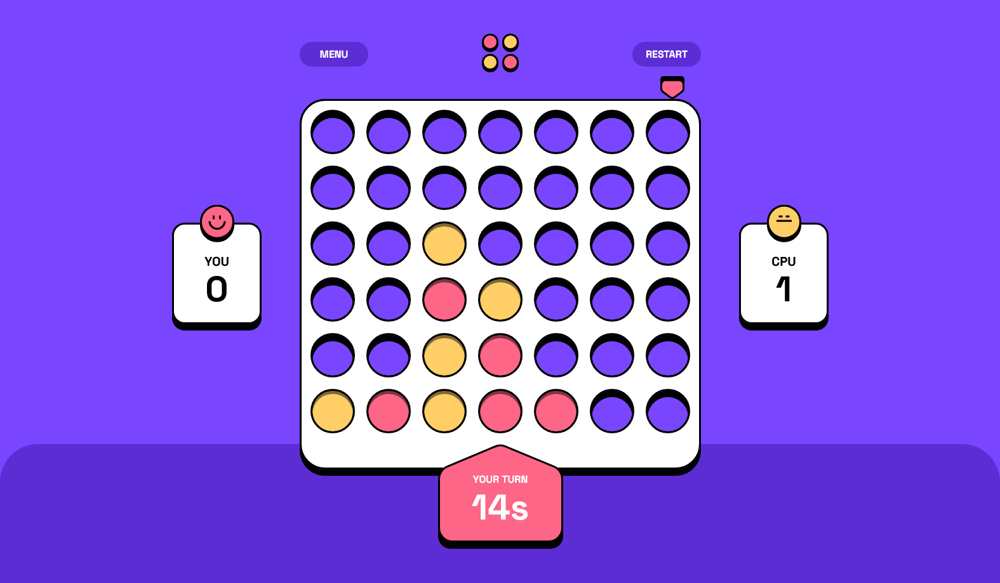
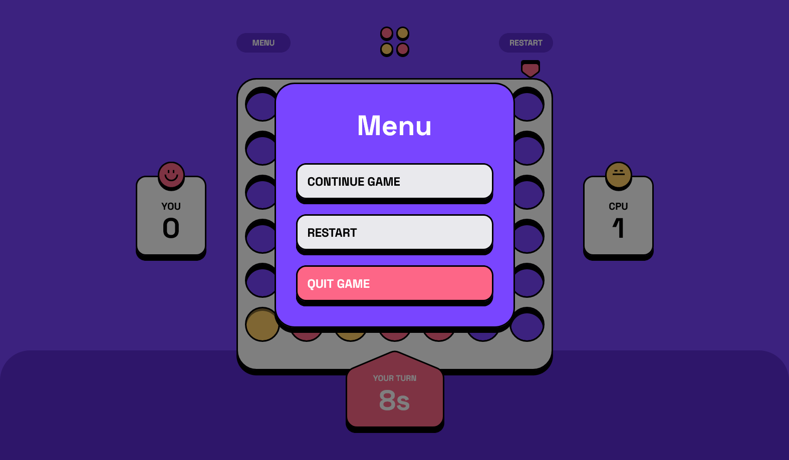
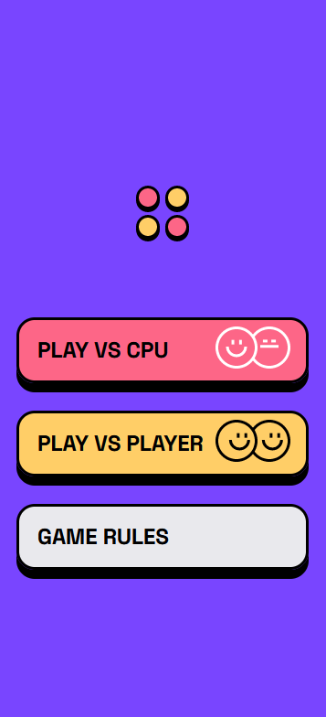
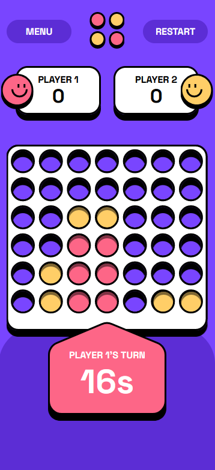

# Frontend Mentor - Connect Four game solution

This is a solution to the
[Connect Four game challenge on Frontend Mentor](https://www.frontendmentor.io/challenges/connect-four-game-6G8QVH923s).
Frontend Mentor challenges help you improve your coding skills by building
realistic projects.

## Table of contents

- [Overview](#overview)
  - [The challenge](#the-challenge)
  - [Screenshots](#screenshot)
  - [Links](#links)
- [My process](#my-process)
  - [Built with](#built-with)
  - [What I learned](#what-i-learned)
  - [Continued development](#continued-development)
  - [Useful resources](#useful-resources)
- [Author](#author)
- [Acknowledgments](#acknowledgments)

## Overview

### The challenge

Users should be able to:

- View the game rules
- Play a game of Connect Four against another human player (alternating turns on
  the same computer)
- View the optimal layout for the interface depending on their device's screen
  size
- See hover and focus states for all interactive elements on the page
- **Bonus**: See the discs animate into their position when a move is made
- **Bonus**: Play against the computer

### Screenshots

 
 

### Links

- Solution URL:
  [GitHub Repository](https://github.com/Astrix1234/connect-four-game)
- Live Site URL:
  [Connect Four Game](https://astrix1234.github.io/connect-four-game/)

## My process

### Built with

- TypeScript for type-safe JavaScript code.
- React - A JavaScript library for building user interfaces.
  - React Hooks: useState, useEffect, useCallback, useContext, and lazy for
    efficient state management and component rendering.
  - Context API for managing game states across different components.
  - React Router for navigational components.
  - React Responsive for creating a responsive design.
- Custom game logic implemented in TypeScript.
- SCSS for styling components.
- React Testing Library for unit testing components.

### What I learned

This project was an excellent opportunity to deepen my understanding of React
and TypeScript. I implemented a complex game logic that includes features like
animations and AI for playing against the computer. It also reinforced my
knowledge in responsive design and unit testing with React Testing Library.

### Continued development

In future projects, I want to focus on:

- Enhancing AI algorithms for a more challenging gameplay.
- Implementing more complex animations and interactive UI elements.
- Exploring state management solutions for large-scale applications.

### Useful resources

- [React Documentation](https://reactjs.org/) - A comprehensive guide to React's
  features and APIs.
- [SCSS Guide](https://sass-lang.com/documentation) - This helped me effectively
  utilize SCSS for styling.
- [React Testing Library](https://testing-library.com/docs/react-testing-library/intro/) -
  A useful resource for writing maintainable tests for React components.
- [TypeScript Documentation](https://www.typescriptlang.org/docs/) - Essential
  for understanding and using TypeScript in your projects.

## Author

- Website - [Astrix1234's GitHub](https://github.com/Astrix1234)
- Frontend Mentor -
  [Astrix1234's Frontend Mentor Profile](https://www.frontendmentor.io/profile/Astrix1234)

## Acknowledgments

I'd like to thank the Frontend Mentor community for providing this challenge,
which has been instrumental in enhancing my web development skills.
