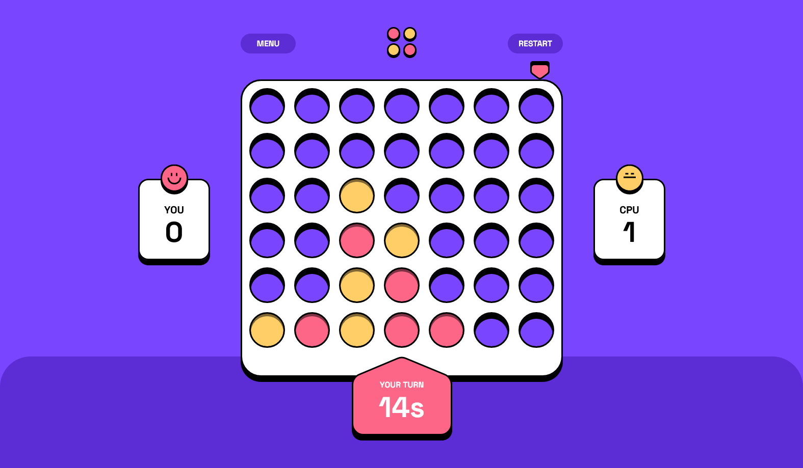
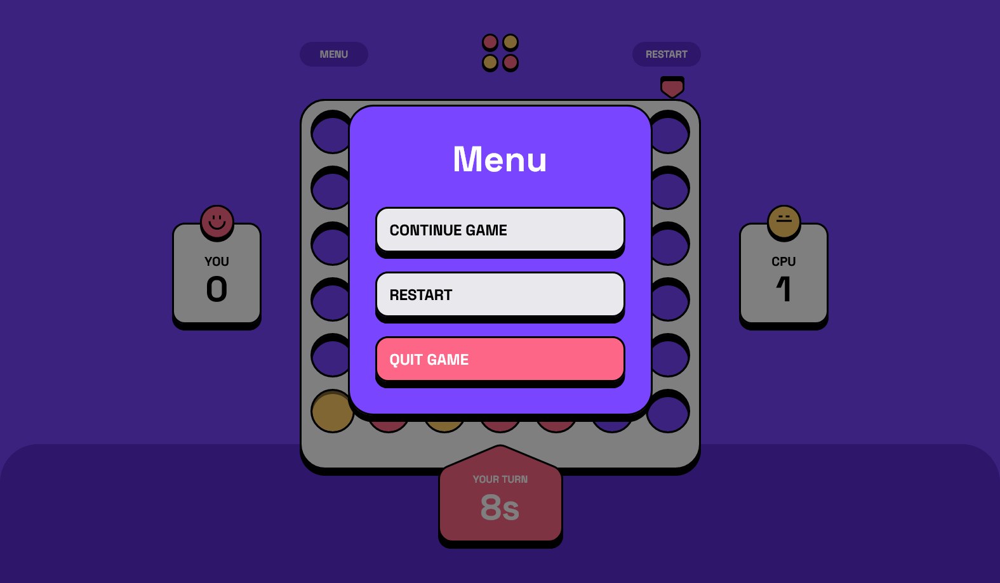
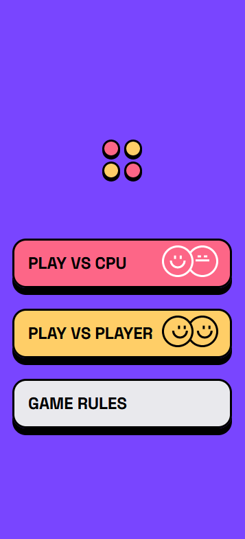
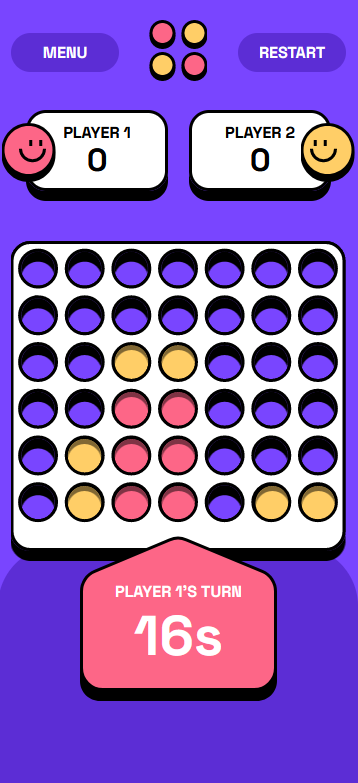

# Connect Four Game (React + TypeScript)

A responsive Connect Four web game built with React and TypeScript.

This project recreates the classic Frontend Mentor Connect Four experience with:

- `Player vs Player` and `Player vs CPU` modes
- animated token drops
- timer-based turns
- match scoreboard
- in-game pause menu
- responsive desktop / tablet / mobile layouts

## Live Demo

- Repository: [Astrix1234/connect-four-game](https://github.com/rafi983/connect-4-game)
- Live Site: [https://astrix1234.github.io/connect-four-game/](https://astrix1234.github.io/connect-four-game/)

## Screenshots






## Features

### Gameplay

- 6x7 Connect Four board
- Red player always starts the round
- Win detection for:
  - horizontal lines
  - vertical lines
  - both diagonal directions
- Draw detection when board is full
- Winning discs are highlighted

### Modes

- **Play vs CPU**
  - human is Player 1 (red)
  - CPU is Player 2 (yellow)
  - CPU uses early-position heuristic + minimax search
- **Play vs Player**
  - two local players alternate turns on the same device

### Round and Match Flow

- 30-second turn timer
- If timer reaches 0, the current player loses the round
- `PLAY AGAIN` resets only the current round
- `RESTART` resets the full match score + board state
- Pause menu actions:
  - continue game
  - restart match
  - quit game (back to start screen)

### Responsive UI

- Device breakpoints handled through `react-responsive`
- Different board assets and class variants for mobile/tablet/desktop
- Board marker follows cursor on desktop

## Tech Stack

- **React 18**
- **TypeScript**
- **React Router v6**
- **SCSS Modules**
- **React Helmet Async**
- **React Responsive**
- **Create React App (`react-scripts`)**

## Project Structure

```text
src/
  assets/
    images/
  components/
    App.tsx
    Layout/
    Buttons/
    StartWindow/
    GameHeader/
    Players/
    ModalMenuGame/
    Game/
      Game.tsx
      gameWithAILogic.tsx
  pages/
    StartPage/
    GamePage/
  stylesheets/
    vars.css
  index.tsx
  index.css
```

## Getting Started

### Prerequisites

- Node.js `>= 18` recommended
- npm `>= 9`

### Installation

```bash
npm install
```

### Run in Development

```bash
npm start
```

Then open `http://localhost:3000`.

### Production Build

```bash
npm run build
```

Build output is generated in the `build/` directory.

### Tests

```bash
npm test
```

## Available Scripts

- `npm start` — start development server
- `npm run build` — create optimized production build
- `npm test` — run test runner
- `npm run eject` — eject CRA config (irreversible)
- `npm run predeploy` — build before deploy
- `npm run deploy` — publish `build/` to GitHub Pages

## Implementation Notes

- Global mode state (`playerVsPlayer`) is shared via `GameContext` in `App.tsx`.
- Routing is split into:
  - `/` → start screen
  - `/game` → game screen
- The board is represented as a 2D array (`Cell[][]`).
- AI helpers in `gameWithAILogic.tsx` expose:
  - `pickBestMove` (early game)
  - `minimax` (deeper game state evaluation)
- UI classes intentionally map to SCSS module contracts to preserve the original visual design.

## Deployment

This project is configured for GitHub Pages using:

- `homepage` in `package.json`
- `gh-pages` deploy scripts

To deploy:

```bash
npm run deploy
```

## Challenge Source

Based on the Frontend Mentor challenge:

- [Connect Four game challenge](https://www.frontendmentor.io/challenges/connect-four-game-6G8QVH923s)

## Author

- Frontend Mentor: [@rafi983](https://www.frontendmentor.io/profile/rafi983)
- Portfolio: [riz82.vercel.app](https://riz82.vercel.app)
